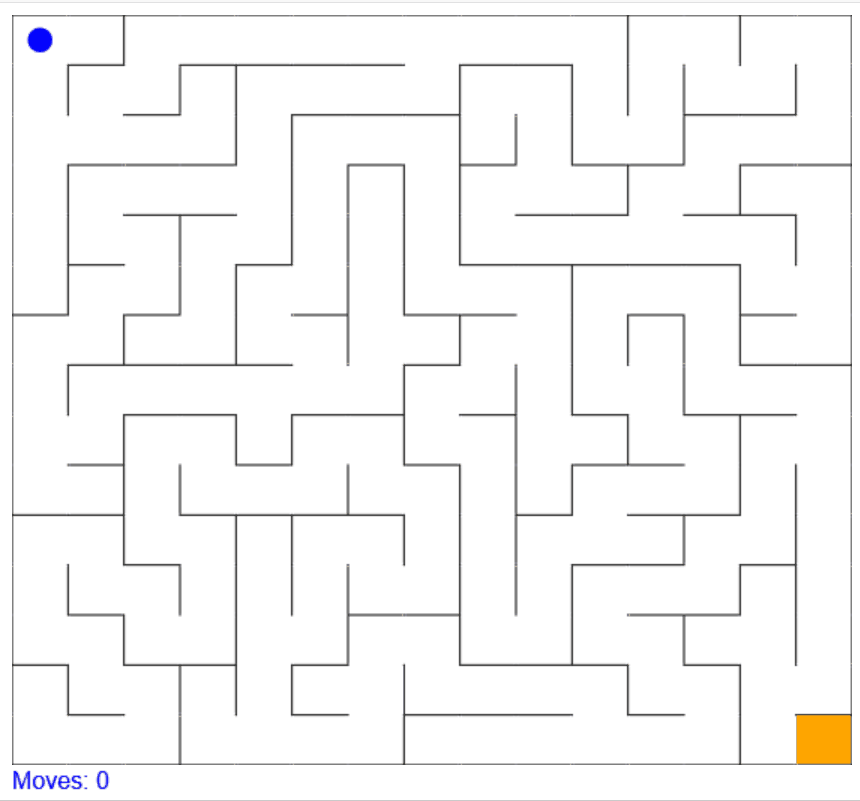

# maze
Randomly generated maze in JavaScript using HTML5 canvas
# About
I started by generating a grid with size determine by the "row" variable on line 15. The number of columns is the same as the number of rows so the grid will be square. I decided to make the starting point of the maze in the top left corner and the finish in the bottom right to increase the chance of the solution path being long. I then used a depth first search algorithm to explore every square and as squares were explored, I removed the wall that separated the previous square with the current one. 
# Demo

